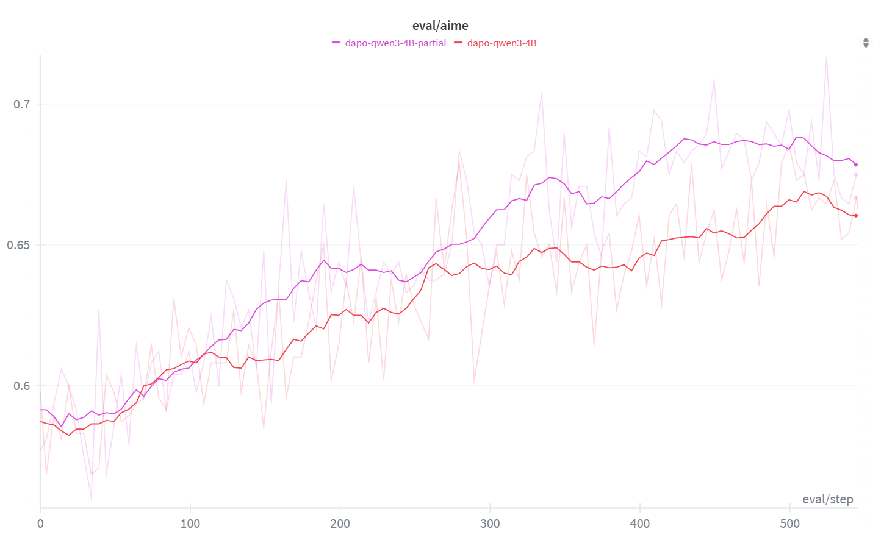

# APRIL: Active Partial Rollouts in Reinforcement Learning to Tame Long-Tail Generation

[Chinese Version](./README_zh.md)

## About

### Background: Why synchronous RL sampling–training loops suffer from “long tails”

- In on-policy RLHF / GRxO training, the system collects **N** rollout samples per round before applying one update. Because generation lengths, refusals/retries, routing queues, etc. are stochastic, the round time is dominated by **the slowest few samples** (a classic long-tail). GPUs idle while “waiting for the tail,” dragging down effective throughput.
- Common mitigations (larger timeouts/early truncation, higher concurrency, faster decoding kernels/continuous batching, or switching to asynchronous RL) all have trade-offs: they may hurt sample quality or policy consistency, complicate scheduling assumptions, or still fail to remove the root cause—**wasted time waiting on unfinished samples**.
### What we built: Active Partial Rollout (APRIL)

**Core idea.** In each round, **oversample by design** (**N' > N**). As soon as the target **N** is met, **proactively abort** straggling requests; persist their **unfinished response segments** (with context and decoding state) into a **cross-round buffer**; and **resume them first** in the next round. This eliminates idle time spent “waiting for the tail.”  
(TODO: add architecture diagram)


### Highlights

- **Long-tail killer.** Launch N' > N rollouts; once N is reached, immediately abort the remainder, **buffer their partial responses**, and **resume them next round**.
- **Stable training.** Plays nicely with mainstream on-policy variants like PPO/GRPO/DAPO/GSPO; in practice we observe comparable or slightly better accuracy.
- **Low-intrusion engineering.** Operates at the scheduling layer without changing decoding/batching kernels; integrated with **slime**, and works on both NVIDIA and AMD.
- **Algorithm-compatible.** Resuming samples can introduce a small amount of “light off-policy,” which we have not found to destabilize training; it often acts as a mild regularizer (faster convergence, slight accuracy gains).
## Quickstart

### 1) Environment

**Recommended (Docker)**

- **AMD**

```bash
docker run --rm --gpus all --ipc=host --shm-size=16g \
  --ulimit memlock=-1 --ulimit stack=67108864 \
  -it rlsys/slime:slime_ubuntu22.04_rocm6.3.4-patch-numa-patch_sglang0.4.9_megatron-patch_ray2.47.1_apex_torch-memory-saver0.0.8-patch-vim /bin/bash
```

- **NVIDIA** (TODO: fill in the matching image tag)

### 2) Install APRIL

```bash
git clone https://github.com/RLsys-Foundation/APRIL.git
cd APRIL
pip install -e .
```

If you plan to run the example scripts, make sure `ray` is installed and at least one inference backend is available (SGLang or vLLM; **SGLang recommended**).

### 3) Run an example

_The script: starts the backend → launches oversampled rollouts → aborts once the target is met → writes unfinished samples to the buffer and resumes them next round → prints per-round throughput/latency._

```bash
bash scripts/partial_rollout/qwen/grpo/run-qwen3-4B-dapo-partial.sh
```

### 4) Parameters

APRIL’s core behavior is controlled by the following flags:

```bash
# Enable partial rollout:
# Turn on "meet target then abort" and reclaim unfinished samples into the buffer.
--partial-rollout

# Sampling batch size per shot. This controls the granularity of each sampling step.
# If this > rollout_batch_size, you will oversample.
# If this < rollout_batch_size, the system keeps sampling in chunks until the target is reached.
--over-sampling-batch-size 16
```

For other options, see the arguments in [arguments.py](https://chatgpt.com/c/slime/utils/arguments.py). For more details, refer to the upstream [slime](https://github.com/THUDM/slime) repository.

## Results vs. Baselines (brief)

|Dataset|Model|Metric|APRIL vs. baseline|
|---|---|---|---|
|DAPO-Math-17k|Qwen3-4B|Rollout Throughput|**+17%**|
|DeepScaleR|Qwen3-4B|Rollout Throughput|**+21%**|
|DeepMath-103K|Qwen3-4B|Rollout Throughput|**+35%**|
|AIME-2024|Various|Final Accuracy|**+2–5%** (data/algorithm-dependent)|


## FAQ

- **Q: Does APRIL hurt policy purity or convergence?**  
    **A:** We have not observed instability in engineering or experiments. Monitor the off-policy token ratio, and use a mild setting like `oversample ≈ 2× roll_batch`.
    
- **Q: Do I need to modify decoding kernels?**  
    **A:** No. APRIL operates at the **scheduling layer** and composes with speculative decoding, continuous batching, and other inference-level accelerations.
    
- **Q: Does it work on both NVIDIA and AMD?**  
    **A:** Yes; we reproduced gains on 8×H100 and 8×MI300.
    

## Repository Structure

```text
APRIL/
├── scripts/
│   └── partial_rollout/
│       ├── deepseek/            # Experiment code for deepseek-r1-distill-1.5B
│       └── qwen/                # Experiment code for Qwen3-4B
├── slime/
│   ├── backends/
│   ├── rollout/
│   │   └── sglang_example.py    # Core sampling example
│   ├── ray/                     # Core scheduling logic
│   │   └── buffer.py            # Buffer implementation
│   └── utils/
└── tools/                       # Megatron-format model conversion
```

## Citation

If APRIL is useful for your work, please cite the APRIL paper and star the repo.  
(TODO: add arXiv link)
