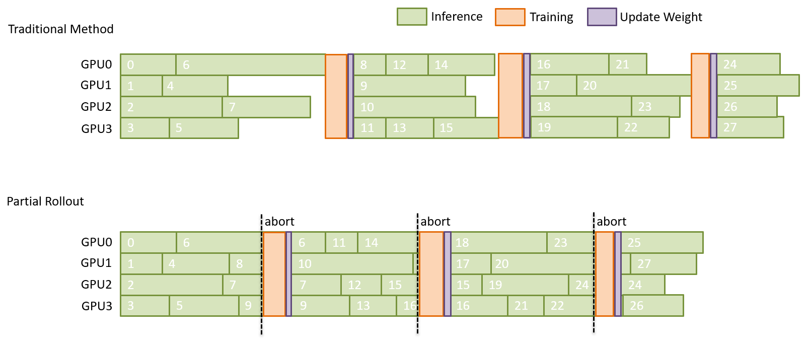

# APRIL：在强化学习中通过主动部分 Rollout 驯服长尾生成

## 关于

### 背景：为什么同步式 RL 的采样—训练闭环会被“长尾”拖慢

在 on-policy 的 RLHF/GR?O 训练中，系统只有在每一“轮”（round）收集到 **N** 个 rollout 样本后才进入更新阶段。由于生成样本长度不一致，系统必须等待少数**长尾样本**完成，才能开始训练阶段。这会导致在 rollout 后段 GPU 利用率下降、吞吐量变低。

### 我们的做法：Active Partial Rollout（APRIL）

**核心思想**：在每一轮中，我们进行**过采样**（N' > N），一旦达到 **N** 个已完成样本的目标，就**主动中断**其余进行中的请求。**未完成的响应**会被存入**缓冲区（buffer）**，并在下一轮中被**优先续生成**，从而缓解长尾请求带来的效率下降。



### 亮点

* **过采样（Over-sampling）**：假设训练阶段每轮需要 `rollout_batch_size=32` 个完整样本，我们实际发起更大的采样请求，例如 `over_sampling_batch_size=64`。
* **达标即停（Stop upon collection）**：一旦收集到的完整样本组数达到 `rollout_batch_size`，立刻向 SGLang 路由器发送 `abort` 信号。
* **收集并复用（Collect and reuse）**：收到 `abort` 后，SGLang 会停止正在进行的生成任务，并返回其已生成的部分（半成品轨迹）。这些**部分样本**不会被丢弃，而是存入缓冲区；在下一轮开始时，它们会与新的提示一起**从中断处继续生成**，从而在迭代步骤间实现无缝复用。
* **优雅实现（Elegant implementation）**：Slime 的部分 rollout 以更原生、轻量的方式优化，对原有流水线侵入极小。只需设置 `--partial-rollout` 并指定 `--over-sampling-batch-size`，即可**开箱即用**。

## 三步快速开始

### 1）环境准备（需要 AMD GPU）

**启动 docker**

```bash
docker run --rm --gpus all --ipc=host --shm-size=16g \
  --ulimit memlock=-1 --ulimit stack=67108864 \
  -it rlsys/slime:slime_ubuntu22.04_rocm6.3.4-patch-numa-patch_sglang0.4.9_megatron-patch_ray2.47.1_apex_torch-memory-saver0.0.8-patch-vim /bin/bash
```

### 2）安装 APRIL

```bash
git clone [https://github.com/RLsys-Foundation/APRIL.git](https://github.com/RLsys-Foundation/APRIL.git)
cd APRIL
pip install -e .
```

### 3）运行示例

所有脚本位于 `scripts/partial_rollout/` 目录。

```bash
bash scripts/partial_rollout/qwen/grpo/run-qwen3-4B-dapo-partial.sh
```

### 4）参数说明

部分 rollout 的核心功能由以下参数控制：

```bash
# 启用部分 rollout
# 设为开启后，将在达到目标数量即停止生成 + 回收未完成样本并复用
--partial-rollout

# 采样批大小。该参数控制每轮的采样粒度。
# 若该值 > rollout_batch_size，则执行过采样。
# 若该值 < rollout_batch_size，则按该粒度持续采样，直到收集满 rollout_batch_size 个样本。
--over-sampling-batch-size 16
```

更多参数请参考 [arguments.py](./slime/utils/arguments.py) 中的参数说明。更详细的信息可参阅上游仓库 [slime](https://github.com/THUDM/slime)。

## 结果与对比（节选）

| 数据集           | 模型       | 指标          | APRIL 相对基线 |
| ------------- | -------- | ----------- | ---------- |
| DAPO-Math-17k | Qwen3-4B | Rollout 吞吐量 | **+17%**   |
| DeepScaleR    | Qwen3-4B | Rollout 吞吐量 | **+21%**   |
| DeepMath-103K | Qwen3-4B | Rollout 吞吐量 | **+35%**   |


## 常见问题（FAQ）

* **问：APRIL 会影响策略纯度与收敛吗？**
  **答：** 会对策略纯度产生影响；单轮中 off-policy tokens 的占比约为 40%。但从工程与实验观察看，在当前设置下，部分 rollout 并未带来显著不稳定性。对于 `max_response_length` 大得多的任务（如智能体、多轮任务）仍需进一步验证。

* **问：需要修改解码内核吗？**
  **答：** 不需要。APRIL 作用在**系统调度层**，与推测解码（speculative decoding）、连续批处理（continuous batching）等推理加速技术并不冲突，且可**叠加使用**、相互补充。

## 目录结构

```
APRIL/
├── scripts/
│   └── partial_rollout/
│       ├── deepseek/               # deepseek-r1-distill-1.5B 的实验代码
│       └── qwen/                   # qwen3-4B 的实验代码
├── slime/
│   ├── backends/
│   ├── rollout/
│   │   └── sglang_example.py       # 核心采样代码
│   ├── ray/                        # 核心调度逻辑
│   │   └── buffer.py               # 缓冲区实现
│   └── utils/
└── tools/                          # Megatron 格式转换工具

```

## 论文

（TODO：论文的 arXiv 链接）
